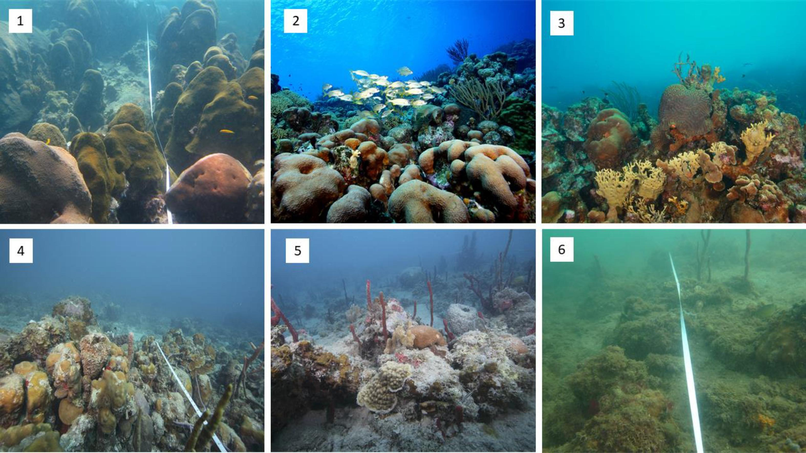

# Collection of web based applicatios to calculate BCG for Puerto Rico and U.S. Virgin Islands

## Introduction

Since 2012 the US Environmental Protection Agency (EPA) and a group of scientific coral reef experts have collaborated to develop a Biological Condition Gradient (BCG) model for the coral reefs of Puerto Rico and the U.S. Virgin Islands (USVI)(USEPA, 2021). The BCG is a conceptual framework (Figure 1) that describes how biological attributes of aquatic ecosystems (i.e., biological condition) are expected to change along a gradient of increasing anthropogenic stress (e.g., physical, chemical, and biological impacts)([Santavy et al., 2022a](https://doi.org/10.1016/j.ecolind.2022.108805)).



BCG Levels are standardized descriptions of biological condition related to assemblage structure, function, and sensitivity to stressors ([Santavy et al., 2022b](https://doi.org/10.1016/j.ecolind.2022.108576)). BCG Level 1 (Figure 2, panel 1) describes an assemblage that occurs when human disturbance is entirely or almost entirely absent. This is an undisturbed condition as naturally occurs. Level 1 conditions are rarely observable in any aquatic environment, especially given ubiquitous stressors introduced by global phenomena such as climate change and atmospheric deposition. Level 6 conditions assemblages have severely altered structure and function compared to natural expectations (Figure 2, panel 6). Levels 2 to 5 have successively decreasing resemblance to biological integrity (Figure 2, panel 2-5). Levels 2-5 are most often observed during BCG calibration exercises. The narrative of the creation process of this conceptual framework is described in detail in [Santavy et al. (2022a)](https://doi.org/10.1016/j.ecolind.2022.108805).

## This repository

This repository contains three web applications developed to assess the Biological Condition Gradient (BCG) model in Puerto Rico and the U.S. Virgin Islands. These applications include:

-   [BCG for Coral Reefs](https://ccri-uprm.shinyapps.io/BCG_Benthic/): Designed to evaluate the health of coral reef ecosystems.

-   [BCG for Fish species](https://ccri-uprm.shinyapps.io/BCG_Fish/): Focused on assessing fish populations and their ecological status.

-   [BCG Formatter](https://ccri-uprm.shinyapps.io/BCG_Formatter/): A tool for formatting and standardizing various datasets to the required format for use in the BCG Coral Reefs and Fish apps.

From October 21 to 25, the U.S. Environmental Protection Agency (EPA) will be hosting a series of workshops to introduce participants to the practical use and applications of these BCG models. Due to limitations on the number of concurrent users who can access the web-based apps, this R package was developed to provide participants with offline versions of the models. This will enable them to run analyses on their local machines during the workshops, ensuring a smoother learning experience without the constraints of online access.

## How to use this tool

First of all, let's install the package in R:

```{r installation, eval=FALSE}

# Install the 'remotes' package, if necessary, then install the workshop package

install.packages("remotes")
remotes::install_github("arturoSP/BCG.PR.USVI")

```

After installation is complete, you can use the apps by typing their names in the console:

```{r usage, eval=FALSE}

# App for Benthic models
BCG.PR.USVI::BCG_Benthic()

# App for Fish model
BCG.PR.USVI::BCG_Fish()

# App for formatting the data
BCG.PR.USVI::BCG_Formatter()

```

Online apps built with [Shiny](https://shiny.rstudio.com) and [R](https://www.r-project.org). The Offline implementation was designed and coded by [Edlin Guerra Castro](https://edlinguerra.github.io) and [Arturo Sanchez-Porras](https://arturosp.github.io).
